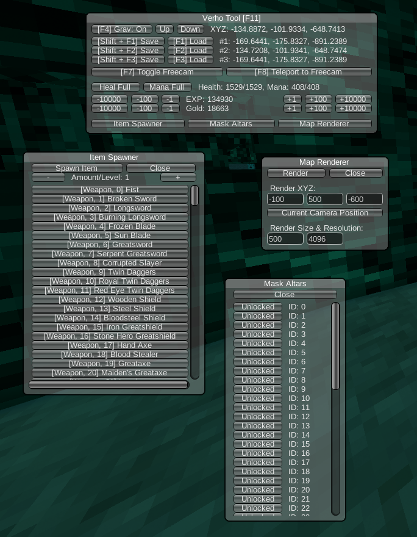

# verho-tool
This is a testing tool for Verho - Curse of Faces, for the purpose of glitch hunting and speedrun routing.

## Features
The tool can be opened by pressing `F11` ingame and currently includes the following features:
- No gravity, as well as hotkey to "nudge" up and down (`PageUp`/`PageDown`)
- Save/Restore position, 3 slots
- Freecam, as well as the ability to teleport to the freecam
- Full heal and mana buttons
- Experience and gold cheats (keep in mind you need to kill an enemy for the experience to properly register and be turned into levels)
- Item spawner
- Mask altar (bonfires) unlocking
- Topdown map renderer (outputs to your pictures folder)

## How to use
- Download the latest version of BepInEx 5 (make sure you pick `BepInEx_win_x64...`): https://github.com/BepInEx/BepInEx/releases
- Extract the BepInEx 5 zip file into the game folder. This means, the files and folders like `winhttp.dll` and `BepInEx` should be next to `Verho.exe`.
- Launch the game once. Close it again once you get to the main menu.
- Go into the `BepInEx > config` folder in your game folder and open `BepInEx.cfg`. In there, look for `HideManagerGameObject` and change it from `false` to `true`.
- Download the latest [release DLL](https://github.com/Vinjul1704/verho-tool/releases) and put it into `BepInEx > plugins` in your game folder.
- [OPTIONAL] Additionally, I'd highly recommend installing RuntimeUnityEditor as well, which gives you a very powerful ingame-editor and is extremely useful for testing (make sure you pick `RuntimeUnityEditor.Bepin5...`): https://github.com/ManlyMarco/RuntimeUnityEditor/releases

## Compiling
If you want to compile the tool yourself, this is how to do it:
- Download and install the latest .NET SDK: https://dotnet.microsoft.com/download
- Install the dotnet BepInEx templates by running the following command in a terminal: `dotnet new install BepInEx.Templates::2.0.0-be.4 --nuget-source https://nuget.bepinex.dev/v3/index.json`
- Download/Clone this repository.
- Copy `Assembly-CSharp.dll` from your Verho game folder into the `lib` folder here.
- Open this repository in a terminal and run the following command: `dotnet build -c Release`
- If everything went well, you will find the compiled DLL in `bin/Release/netstandard2.1/`
